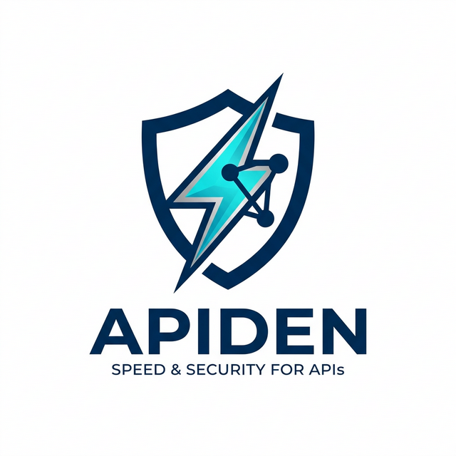

<div align="center">
  
  <h1>Apiden</h1>
  <p><b>Standardized, Secure, and High-Performance API Foundations</b></p>

  [](https://dev.azure.com/azmankudus/apiden)
  [](https://micronaut.io/)
  [](https://jdk.java.net/21/)
  [](LICENSE)
</div>

---

## 🚀 Overview

**Apiden** is a modern Micronaut-based framework designed to provide a robust foundation for building standardized, secure, and developer-friendly APIs. It enforces best practices in API design, including consistent response envelopes, sophisticated error handling, and high-performance networking.

Developed with **Micronaut 4** and **Java 21**, Apiden leverages the latest advancements in the JVM ecosystem to deliver exceptional performance and developer productivity.

## ✨ Key Features

- 🛠 **Standardized API Envelopes**: Consistent response structures for all API endpoints, including success and error scenarios.
- 🛡 **Robust Error Handling**: Centralized exception management with meaningful error codes and messages.
- ⚡ **High Performance**: Built on top of **Netty**, optimized for low-latency and high-throughput IO.
- 🧬 **AOT Compilation Support**: Ready for GraalVM Native Image for lightning-fast startup and low memory footprint.
- 📐 **Modular Architecture**: Clean separation of concerns between API definitions, business logic, and infrastructure.

## 🛠 Technical Stack

- **Core Framework**: [Micronaut 4.x](https://micronaut.io/)
- **Language**: [Java 21](https://jdk.java.net/21/)
- **Runtime**: [Netty](https://netty.io/)
- **Build System**: [Gradle (Kotlin DSL)](https://gradle.org/)
- **Serialization**: [Micronaut Serde](https://micronaut-projects.github.io/micronaut-serialization/latest/guide/)
- **Logging**: [Logback](https://logback.qos.ch/)

## 🚦 Getting Started

### Prerequisites

- Java 21+
- Git

### Build & Run

1. **Clone the repository**:
   ```bash
   git clone https://github.com/azmankudus/apiden.git
   cd apiden
   ```

2. **Build the project**:
   ```bash
   ./gradlew build
   ```

3. **Run the application**:
   ```bash
   ./gradlew run
   ```

## 📂 Project Structure

```text
apiden/
├── src/main/java/com/example/apiden/
│   ├── Main.java              # Application Entry Point
│   ├── shared/                # Core Shared Modules
│   │   ├── api/               # API Standard Envelopes & Handlers
│   │   └── infrastructure/    # Infrastructure & Cross-cutting concerns
│   └── module/                # Business Domain Modules
├── gradle/                    # Gradle Wrapper & Dependencies
└── docs/                      # Documentation & Assets
```

## 📜 Documentation

- [Project Requirements](REQUIREMENTS.md)
- [Agentic Documentation](.agent/README.md)

## ⚖️ License

This project is licensed under the MIT License - see the [LICENSE](LICENSE) file for details.