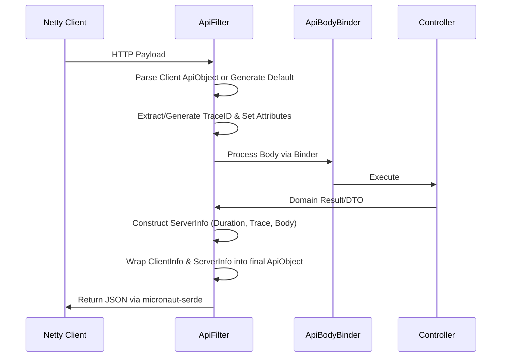

# Apiden Technical Specification

This document provides a highly accurate, code-backed technical overview of the **Apiden** project, covering its architecture, true data schema, error handling, and infrastructure.

## 1. System Architecture & Frameworks

Apiden is built natively on **Micronaut 4.x** and **Java 21**, following a modular structure that separates the core API platform and routing from business domain logic.

### 🛠 Core Technologies
- **Framework**: Micronaut Application Framework.
- **Language**: Java 21 LTS (utilizing Records and modern JVM features).
- **Runtime Server**: Netty (Event loop-based, non-blocking IO).
- **Serialization SDK**: `micronaut-serde` (Reflection-free JSON serialization via `io.micronaut.serde.annotation.Serdeable`).
- **Logging**: SLF4J with Logback, featuring a `CustomRollingPolicy` for log rotation.
- **Build System**: Gradle with Kotlin DSL (`build.gradle.kts`), using the Micronaut Gradle Plugin and Shadow Plugin for fat JAR generation.
- **Code Generation**: `micronaut-sourcegen` (`@Builder`, `@ToString` mappings).

---

## 2. True API Schema (`ApiObject`)

Apiden enforces a complex, metadata-rich **Universal Response Envelope** known as `ApiObject`. This envelope completely separates client context from server processing context.

There is NO flat `data`, `status`, or `error` at the root. The exact schema is as follows:

### 📦 `ApiObject` (Root Envelope)
| Field | Type | Description |
| :--- | :--- | :--- |
| `client` | `ClientInfo` | Metadata explicitly captured from the inbound HTTP request. |
| `server` | `ServerInfo` | Metadata generated by the Micronaut server and application logic. |

### 🛂 `ClientInfo`
| Field | Type | Description |
| :--- | :--- | :--- |
| `http` | `ClientHttpInfo` | Contains inbound HTTP `headers` (if `include-client-headers:true`). |
| `request` | `ClientRequestInfo` | Contains client `traceid`, `timestamp`, and the core `body` payload. |
| `response` | `ClientResponseInfo` | Contains client-expected `timestamp` and `duration`. |

### 🖥 `ServerInfo`
| Field | Type | Description |
| :--- | :--- | :--- |
| `http` | `ServerHttpInfo` | Server HTTP `status` code and outbound `headers`. |
| `request` | `ServerRequestInfo` | The server-resolved `timestamp` and `traceid`. |
| `response` | `ServerResponseInfo` | Contains the actual processing result. See below. |

### 🚀 `ServerResponseInfo` (The Actual Payload)
This is where the business execution results reside.
| Field | Type | Description |
| :--- | :--- | :--- |
| `timestamp` | `OffsetDateTime` | Time the response was created. |
| `duration` | `String` | Execution duration (e.g., `PT0.012S`). |
| `status` | `String` | High-level status (e.g., `"success"`, `"ERROR"`). |
| `code` | `String` | Granular response code (e.g., `"0"`, `"500"`). |
| `message` | `String` | Human-readable message (e.g., `"Success"`). |
| `body` | `Object` | The actual domain DTO, Record, or Error Map. |

---

## 3. Mechanism & Data Flow

Apiden leverages a **Reactive Pipeline** powered by Micronaut's Filter mechanism.

---

## 4. Error & Exception Handling

The system abstracts exceptions to prevent raw stacktraces from bleeding into the client unexpectedly.

### `ApiException` & `ApiExceptionHandler`
- **Class**: `com.example.apiden.shared.api.ApiException`
- **Handler**: `ApiExceptionHandler` (implements `ExceptionHandler<ApiException, HttpResponse<ResponseBody>>`).
  
When a controller throws an `ApiException`:
1. The `ApiExceptionHandler` intercepts it.
2. It structures the error into a `ResponseBody(ResponseStatus.ERROR, code, message, exceptionDataMap)`.
3. The `stacktrace` is injected into `exceptionDataMap` ONLY IF `application.api.envelope.include-stacktrace:true`.
4. The handler returns an `HttpResponse.serverError(ResponseBody)`.
5. The **`ApiFilter` (Egress)** intercepts this `ResponseBody`, mapping its fields (status, code, message, and body) directly into the `ServerResponseInfo` section of the ultimate `ApiObject` envelope.
